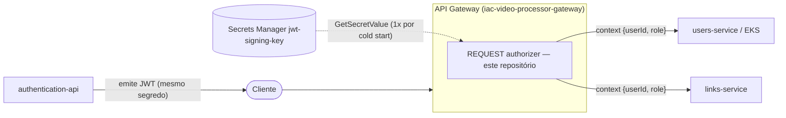

# video-processor-authorizer

Lambda **REQUEST authorizer** da borda do API Gateway do Tech Challenge FIAP X (Fase 5 — Hackathon, 13SOAT). Valida o JWT de sessão emitido pelo `video-processor-authentication-api` e devolve `{userId, role}` no `context` do authorizer. **100% stateless**: sem banco de dados, sem session store — a decisão é baseada exclusivamente nos claims assinados do token.

Repositório correspondente na organização: [`video-processor-authorizer`](https://github.com/13SOAT-andromeda/video-processor-authorizer).

---

## 1. Onde este serviço se encaixa na plataforma

Este é **só um dos microsserviços** da arquitetura descrita em `arquitetura-video-processing-tech-challenge.md`. A infraestrutura compartilhada vive em repositórios separados:

| Repositório | Responsabilidade | Relação com este serviço |
|---|---|---|
| [`iac-video-processor-gateway`](https://github.com/13SOAT-andromeda/iac-video-processor-gateway) | API Gateway HTTP API + REQUEST authorizer | Consome a Lambda `video-processor-authorizer` (nome fixo, via `data.aws_lambda_function`) como authorizer de todas as rotas autenticadas |
| [`iac-video-processor-infra`](https://github.com/13SOAT-andromeda/iac-video-processor-infra) | VPC, EKS, ECR, filas/tópicos SNS/SQS, bucket S3 | Provisiona o repositório ECR onde a imagem desta Lambda é publicada |
| `video-processor-authentication-api` | Login/signup (Lambda) | **Emite** os JWTs que este serviço valida — mesmo segredo compartilhado `jwt-signing-key` (Secrets Manager); aqui o token é só **validado**, nunca emitido |
| [`video-processor-users-api`](https://github.com/13SOAT-andromeda/video-processor-users-api) | CRUD de perfis de usuário (RDS, EKS) | Roda atrás deste authorizer na borda, mas revalida o JWT por conta própria (integração `HTTP_PROXY`/ALB — defesa em profundidade, ADR-011) |
| [`video-processor-link-api`](https://github.com/13SOAT-andromeda/video-processor-link-api) | Links de upload/download (DynamoDB) | Lê `userId`/`role` do `context` propagado por este authorizer |

Este serviço roda como **Lambda** (arm64, 128 MB, timeout 3 s): está no caminho de *toda* requisição autenticada, então precisa de cold start mínimo e custo por invocação — o oposto do perfil do `users-api`, que precisa de pool de conexão e consumer contínuo e por isso roda em EKS.



**Princípio central:** este é o único ponto de decisão de **autenticação** da borda — nenhuma lógica de autorização por rota/role vive aqui (ADR-011). A checagem de `role administrator` das rotas administrativas continua inteiramente nos handlers de cada serviço downstream. O authorizer não deveria conseguir tocar nenhum dado de negócio mesmo que comprometido: zero acesso a RDS, DynamoDB, S3, SQS ou SNS.

---

## 2. Contrato de entrada/saída

Lambda authorizer do tipo **`REQUEST`** (não `TOKEN`) do API Gateway HTTP API, payload format 2.0 com *simple responses* — `REQUEST` porque precisamos devolver `userId` e `role` no `context`, não só um allow/deny binário.

**Entrada** (evento `APIGatewayV2CustomAuthorizerV2Request`):

```json
{ "headers": { "authorization": "Bearer eyJhbGciOi..." }, "routeArn": "arn:aws:execute-api:..." }
```

**Saída — sucesso:**

```json
{ "isAuthorized": true, "context": { "userId": "abc", "role": "user" } }
```

**Saída — negado:** `{ "isAuthorized": false }` → o API Gateway responde `403` automaticamente.

Cache de autorização no gateway: `authorizerResultTtlInSeconds = 300`, chave = header `Authorization` (o mesmo token não reinvoca a Lambda a cada request).

---

## 3. Regras de validação

Implementadas em [`internal/auth/jwt.go`](internal/auth/jwt.go) e [`cmd/authorizer/main.go`](cmd/authorizer/main.go):

1. Extrai o token de `Authorization: Bearer <jwt>` (o API Gateway v2 entrega o header em minúsculas); ausência ou formato inválido → nega imediato, sem tentar parsear.
2. Valida a assinatura **HS256** com o segredo carregado do Secrets Manager **uma única vez por cold start** (fora do handler), reusado em toda invocação warm.
3. Valida expiração (`exp`) via `golang-jwt/jwt/v5` — token expirado → nega.
4. Rejeita token cujo claim `typ` não seja exatamente `"session"`: o `authentication-api` emite dois tipos de token com a mesma assinatura (`session` TTL 1h e `verification` TTL 24h) — sem essa checagem, um token de verificação de e-mail vazado poderia ser reaproveitado como sessão.
5. Exige claims `sub` (userId) e `role` não vazios — são o que vai pro `context`.
6. **Não consulta banco em nenhuma hipótese** — decisão 100% baseada nos claims assinados.

| Caso | Resultado |
|---|---|
| JWT assinado corretamente, não expirado, `typ: "session"` | `isAuthorized: true` + context |
| Token expirado / assinatura inválida / claims faltando | `isAuthorized: false` |
| Header ausente ou sem prefixo `Bearer ` | `isAuthorized: false` |
| Token de verificação (`typ: "verification"`) usado como sessão | `isAuthorized: false` |

---

## 4. Estrutura de pastas

```
cmd/authorizer           main da Lambda — carga do segredo, wrapper Datadog, handler
internal/auth            extração do Bearer + validação do JWT (HS256, typ, sub, role)
internal/config          carrega tudo de variáveis de ambiente
pkg/utils                loggers estruturados (stdout/stderr)
terraform/dev            Terraform apontando pro LocalStack (role least-privilege própria)
terraform/prod           Terraform apontando pra AWS real (LabRole fixa)
docs/superpowers/        spec de design e plano de implementação
```

---

## 5. Rodando localmente

### Pré-requisitos

- Go 1.25+

Não há servidor HTTP local — o binário é um handler de Lambda. O ciclo de desenvolvimento é build + testes:

```bash
go build ./...
go vet ./...
go test ./... -v
```

Os testes de [`cmd/authorizer/main_test.go`](cmd/authorizer/main_test.go) e [`internal/auth/jwt_test.go`](internal/auth/jwt_test.go) exercitam o handler direto com eventos sintéticos e cobrem a tabela de casos da seção 3 — nenhuma dependência de AWS ou Datadog é necessária pra rodá-los.

Para testar contra infraestrutura local, `terraform/dev/` aponta pro LocalStack (`http://localhost:4566`) — ver seção 8.

---

## 6. Configuração (variáveis de ambiente)

Injetadas pelo módulo Terraform ([`terraform/*/lambda.tf`](terraform/prod/lambda.tf)) — não existe `.env` neste repositório:

| Variável | Uso | Valor em produção |
|---|---|---|
| `JWT_SIGNING_KEY_SECRET_NAME` | nome do secret com a chave de assinatura JWT | `jwt-signing-key-<env>` (Secrets Manager, mesmo segredo usado por `authentication`/`users-api`/`link-api` — ADR-013) |
| `AWS_REGION` | região do SDK | auto-injetada pelo runtime da Lambda (variável reservada — o Terraform não a define; default `us-east-1` no código) |
| `DD_SERVICE` / `DD_ENV` / `DD_VERSION` | identidade do serviço no Datadog | `video-processor-authorizer` / ambiente / tag da imagem publicada |
| `DD_SITE` / `DD_API_KEY_SECRET_ARN` | destino e credencial do Datadog (lidos pela Lambda Extension, não pelo código Go) | site real + ARN do secret com a API key |
| `DD_TRACE_ENABLED` / `DD_LOGS_INJECTION` | liga APM e correlação de logs | `true` / `true` |

---

## 7. Observabilidade (Datadog)

APM via [`github.com/DataDog/dd-trace-go/v2`](https://github.com/DataDog/dd-trace-go) + **Datadog Lambda Extension** embarcada na imagem (container-image Lambda não aceita Layers — a extension é copiada pra `/opt/extensions/` no build, ver [`Dockerfile`](Dockerfile)).

- `ddlambda.WrapFunction` envolve o handler e gerencia o tracer sozinho (start lazy no cold start, flush a cada invocação pra sobreviver ao freeze/thaw) — diferente do `users-api`, que chama `tracer.Start` explicitamente por ser processo longo.
- Toda chamada ao SDK da AWS (Secrets Manager) vira span aninhado via `awstrace.AppendMiddleware`.
- Métrica customizada `video_processor.authorizer.validations` com tags `result:allow`/`result:deny` e `reason:*` (`missing_auth_header`, `invalid_auth_header`, `token_not_session`, `invalid_token`) — pico anômalo de deny pode indicar ataque de token forjado ou bug de expiração no client.
- Logs **nunca** carregam o JWT completo: só os 6 primeiros/últimos caracteres, para correlação (spec, seção 8).

---

## 8. Build, imagem Docker & deploy (Terraform)

Multi-stage ([`Dockerfile`](Dockerfile)): build em `golang:1.25-bookworm` (`GOOS=linux GOARCH=arm64 CGO_ENABLED=0`, binário `bootstrap` em `/var/runtime`); imagem final `public.ecr.aws/lambda/provided:al2023-arm64` + Datadog Lambda Extension (tag numérica pinada, não `:latest`).

O Terraform **não builda nem publica a imagem** — só referencia uma tag já existente no ECR via `data.aws_ecr_repository` + `var.image_tag` (obrigatória, sem default). Build e push manuais antes do `apply`:

```bash
docker build -t video-processor-authorizer:<tag> .
docker tag video-processor-authorizer:<tag> <ecr-repository-url>:<tag>
docker push <ecr-repository-url>:<tag>
```

Depois, a partir de `terraform/dev/` ou `terraform/prod/`:

```bash
terraform init
terraform apply -var image_tag=<tag>
```

### Ambientes

| | `terraform/dev/` | `terraform/prod/` |
|---|---|---|
| Alvo | LocalStack (`http://localhost:4566`) | AWS real |
| IAM | role própria least-privilege — `secretsmanager:GetSecretValue` só nos ARNs dos secrets JWT e Datadog (spec, seção 7) | `LabRole` fixa (`create_role = false`) — o sandbox AWS Academy não permite criar IAM role/policy customizada |

A função se chama **`video-processor-authorizer`** — nome fixo, exato: é contrato consumido pelo `iac-video-processor-gateway` via `data.aws_lambda_function`.

**Ponto em aberto (2026-07-19):** como a imagem chega no ECR sem pipeline de CI (fluxo manual acima vs. GitHub Actions futuro) é decisão do time, rastreada na spec de design — fora de escopo, junto com *provisioned concurrency* (recomendada, não implementada).

